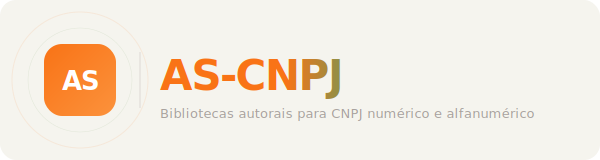

  

  Ecossistema autoral de bibliotecas para CNPJ numérico e alfanumérico, com contrato compartilhado entre linguagens, vetores oficiais e documentação consolidada.

  <a href="https://as-cnpj.org">Site</a> ·
  <a href="https://github.com/as-cnpj">Org GitHub</a> ·
  <a href="vectors/cnpj.json">Vetores</a> ·
  <a href="AUDIT.md">Auditoria</a> ·
  <a href="SECURITY.md">Segurança</a>

  
  
  
  

Idiomas: **Português (Brasil)** | [English](README.en.md) | [Español](README.es.md) | [Français](README.fr.md)

## Bibliotecas publicadas

- [as-cnpj-js](https://github.com/as-cnpj/as-cnpj-js) | JavaScript/TypeScript | pacote npm [`@ascnpj/core`](https://www.npmjs.com/package/@ascnpj/core)
- [as-cnpj-python](https://github.com/as-cnpj/as-cnpj-python) | Python | pacote PyPI [`as-cnpj`](https://pypi.org/project/as-cnpj/)

## O que este hub centraliza

- manifesto e princípios do ecossistema;
- fontes oficiais da Receita Federal;
- vetores compartilhados e schema;
- governança, segurança e auditoria;
- catálogo dos repositórios da família.

## Comece por aqui

- [Manifesto e princípios](docs/manifesto-as-cnpj.md)
- [Fontes oficiais e regras de negócio](docs/fontes-oficiais-e-regras.md)
- [Arquitetura e migração para CNPJ alfanumérico](docs/arquitetura-e-migracao.md)
- [Guia prático de armazenamento e migração](docs/guia-pratico-de-armazenamento-e-migracao.md)
- [Roadmap de ferramentas e capacidades](docs/roadmap-de-ferramentas-e-capacidades.md)
- [Vetores compartilhados](vectors/cnpj.json)
- [Schema dos vetores](vectors/cnpj.schema.json)
- [Portfólio do ecossistema](docs/portfolio-de-bibliotecas.md)
- [Política de segurança](SECURITY.md)
- [Auditoria de segurança](AUDIT.md)

## Fatos oficiais centrais

- o marco consultado continua sendo **julho de 2026**;
- os CNPJs atuais continuam válidos;
- os dois formatos coexistem;
- as 12 primeiras posições aceitam `A-Z0-9`;
- os 2 dígitos verificadores continuam numéricos;
- o cálculo do DV continua em módulo 11 com conversão `ASCII - 48`.

## Repositórios da família

| Repo | Papel | Estado |
| --- | --- | --- |
| `as-cnpj` | Hub central, manifesto, vetores, auditoria e governança | Atual |
| `as-cnpj-js` | Biblioteca autoral para JavaScript/TypeScript | Publicado |
| `as-cnpj-python` | Biblioteca autoral para Python | Publicado no PyPI |
| `as-cnpj-java` | Biblioteca autoral para Java | Planejado |
| `as-cnpj-dotnet` | Biblioteca autoral para C# /.NET | Planejado |
| `as-cnpj-go` | Biblioteca autoral para Go | Planejado |

## Próximo foco recomendado

- documentação prática de armazenamento e migração;
- ferramentas públicas no site;
- validação em lote nas bibliotecas;
- `as-cnpj-java` como próximo runtime.

## Manutenção

Maintainer: **@0moura**  
Contato institucional: **ascnpj@0moura.io**

- [Site e documentação](https://as-cnpj.org)
- [Comunidade e apoiadores](https://as-cnpj.org/pt/community)
- [Como contribuir](CONTRIBUTING.md)
- [Política de segurança](SECURITY.md)
